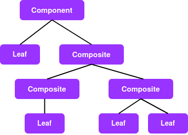
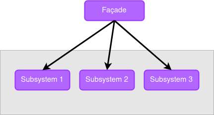

# What is Design Pattern?
কোনো application তৈরী করার সময়, আমরা ভিন্ন ভিন্ন জায়গায় কিছু একই রকম সমস্যার সম্মুখীনন হলে, সমস্যাগুলোর সমাধান এর জন্য যদি একটা reusable pattern design করা যায়, যা ঐ সমস্যাগুলোর জন্য একটা ভালো সমাধান দিতে পারে। তবে advanced এই সমাধানকেই আমরা Design pattern বলি।
সহজ কথায়, **Design pattern হলো একটা কমন সমস্যার জন্য তৈরী করা reusable সমাধান।** ডিজাইন প্যাটার্ন বোঝা বা এর সাথে পরিচিত হওয়াটা বেশ প্রয়োজন কেননাঃ 
* Pattern হলো নির্দিষ্ট সমস্যার জন্য প্রমানিত সলুশান।
* Application development processএর সময় এটা ছোটো খাটো issue থেকে বাচাতে সাহায্য করে যেটা ভবিষ্যতে application এর বড় ক্ষতি করতে পারতো
* নির্দিষ্ট Pattern আমাদের  application এর ওভারওল কোডের সাইজকে ছোটো করে। একই সাথে কোডকে আরো বেশি readble করে।
* এটা reusable


# Categories Of Design Pattern
৩ টা ক্যাটাগরিতে মোটামুটি ২৩ টা প্যাটার্নকে ডিজাইন প্যাটার্নের ফাউন্ডেশান ধরা হয় [এদেরকে 23 Gang of Four (GoF) patterns বলা হয় ]। ক্যাটাগরিগুলো হলোঃ
* [**Creational**](#Creational-Design-Patterns)
    - [Abstract Factory](#Abstract-Factory)
    - [Builder](#Builder)
    - [Factory Method](#Factory-Method)
    - [Prototype](#Prototype)
    - [Singleton](#Singleton)
* [**Structural**](#Structural-Design-Patterns)
    -  [Adapter](#Adapter)
    - [Bridge](#Bridge)
    - [Composite](#Composite)
    - [Decorator](#Decorator)
    - [Facade](#Facade)
    - Flyweight
    - Proxy
* [**Behavioral**](#Behavioral-Design-Patterns)
    - Chain of Resp
    - Command
    - Interpreter
    - Iterator
    - Mediator
    - Memento
    - Observer
    - State
    - Strategy
    - Template Method
    - Visitor
<br>
<br>
<br>


# #Creational Design Patterns
Creational pattern মূলত object তৈরীর মেকানিজমগুলোর নিয়ন্ত্রন প্রক্রিয়ার উপর ফোকাস করে।
কোনো উদ্ভূত সমস্যার জন্য এই প্যাটার্নের basic approach টা হচ্ছে, প্রোজেক্টে কিছু কপ্লিক্সিটি (যাকে আমরা প্যাটার্ন বলছি) যুক্ত করে object creation process টা controll করা যাতে করে সমস্যার একটা সুষ্ঠ সমাধান দেয়া সম্ভব হয়। এই ক্যাটাগরীর অন্তর্ভূক্ত pattern গুলো হলোঃ Abstract Factory, Builder,  Factory Method, Prototype and Singleton.
<br>

## Abstract Factory
Abstract factory, একই বিষয়ের দ্বারা সম্পর্কযুক্ত বিভিন্ন অব্জেক্ট তৈরী করে। সহজ কথায়, এটা এমন একটা প্যাটার্ন যেখানে একটি Factory object থাকবে - যার কাজ হলো অন্য আরেক রকমের অব্জেক্ট তৈরী করা।

কিন্তু প্রশ্ন হচ্ছে, আমরা কেনো একটা Factory object ব্যবহার করে অন্যান্য object তৈরী করবো! যখন আমরা এই কাজটা সরাসরি **new** keyword ব্যবহারের মাধ্যমে constructor ফাংশন call করেই করতে পারি?\
এর কারন, একটা object তৈরীর পুরো পদ্ধতির উপর constructor ফাংশনের খুব অল্প নিয়ন্ত্রন থাকে। তার মানে,একটা অব্জেক্ট তৈরীর জন্য যে বেসিক কাজগুলো করতে হয় কন্সট্রাক্টর ফাংশন তা করে আমাদেরকে একটা অব্জেক্ট তৈরী করে দেয়। কিন্তু, অনেক সময় দেখা যায় একটা ওব্জেক্ট তৈরীর জন্য আমাদের আরো কিছু বিষয়ের উপর নিয়ন্ত্রনের প্রয়োজন হচ্ছে। সেক্ষেত্রে আমরা কন্সট্রাক্টর ফাংশনের উপর নির্ভর না করে, এমন একটা অব্জেক্টকে এই অব্জেক্ট তৈরীর দায়িত দেই যা ঐ বিষয়গুলো কিভাবে নিয়ন্ত্রন করতে হয়ে তা জানে।

### Example :
মনেকরি, মোঃ মফিজ সাহেবের আইস্ক্রিম ও কেক বানানোর দুইটা আলাদা কারখানা আছে। তিনি চাচ্ছেন, তার দুই কারখানার সব কাস্টমারকে একজায়গায় আলাদা আইডেন্টিটি দিয়ে রাখবেন। এবই কাস্টোমারের ঐ লিস্টে, আইস্ক্রিম কারখানার সাথে সম্পর্কযুক্ত কাস্টমারগুলোকে বলা হবে IcecreamCustomer আর কেক কারখানার সাথে সম্পর্কযুক্ত কাস্টমারদের বলা হবে CakeCustomer
``` javascript
function IcecreamCustomer(name) {
    this.name = name;
    this.say = function () {
        console.log(name + " is a icecream customer ");
    };
}
 
function IcecreamFactory() {
    this.addCustomer = function(name) {
        return new IcecreamCustomer(name);
    };
}
 
function CakeCustomer(name) {
    this.name = name;
    this.say = function () {
        console.log(name + " is a cake customer ");
    };
}
 
function CakeFactory() {
    this.addCustomer = function(name) {
        return new CakeCustomer(name);
    };
}
 
function run() {
    var customer = [];
    var icecreamFactory = new IcecreamFactory();
    var cakeFactory = new CakeFactory();
 
    customer.push(icecreamFactory.addCustomer("Ahmed Abdul Barkik"));
    customer.push(icecreamFactory.addCustomer("Sabbir Hasan"));
    customer.push(cakeFactory.addCustomer("Tanzid Hasan"));
    customer.push(cakeFactory.addCustomer("Abdur Rakib"));
 
    for (let i = 0, len = customer.length; i < len; i++) {
        customer[i].say();
    }
}
run();
```
[**Back to top?**](#Categories-Of-Design-Pattern)
<br>

## Builder
যে pattern-এ একটি অব্জেক্টের (Builder object-এর) সহযোগিতায় বিভিন্ন কমপ্লেক্স object-এর কমপ্লেক্স অপারেশান এর ডেফিনেশন না জেনেই সে অব্জেক্টের অপারেশঙ্গুলো নিয়ন্ত্রন করতে পারা যায় তাই-ই Builder pattern

এভাবে object তৈরীর মূল উদ্দেশ্য হলো, client সাইটে বিভিন্ন অপারেশনগুলো সহজ করা। আর উপকারিতা হলো, একজন client বিভিন্ন কমপ্লেক্স object-গুলোর ডেফিনেশাঙ্গুলো না জেনেউ সে object-কে সহজে ব্যবহার করতে পারবে।

-"builder" বিভিন্ন কমপ্লেক্স object তৈরী ও object-গুলোর বিভিন্ন intermediate state মেইন্টেইন করতে পারে। আর অব্জেক্ট তৈরী এবং তাকে মেইন্টেইন এর মাধ্যমে তৈরী করে বিভিন্ন প্রোডাক্ট। আর প্রোডাক্ট তৈরী শেষ হলে ক্লায়েন্ট সেই ফলাফল (তৈরীকৃত প্রোডাক্ট) "builder" থেকে retrieve করতে পারে।

### Example :
মনেকরি, মোঃ মফিজ সাহেব, তার আইস্ক্রিম ও কেকের কারখানায় জন্য 'আব্দুস সালাম' নামের একজন লোককে ম্যানেজার হিসেবে নিয়োগ করেছে। এখন এটা স্বাভাবিক যে সালাম ভাই এর জন্য প্রতিটা কারখানায় আইস্ক্রিম আর কেক আলাদা আলাদা ভাবে তৈরীর প্রতিটা স্টেপ মেইন্টেইন করা সম্ভব না। 
সালাম ভাই এর কাজ হলো, কিভাবে কেক বানানো হয় বা কিভাবেই বা আইস্ক্রিম বানানো হয় তা নিয়ে মাথা না ঘেমে, বরং প্রোডাক্টগুলো (আইস্ক্রিম বা কেক) ঠিক ভাবে শিডিওল অনুযায়ী তৈরী হচ্ছে কিনা সেদিক খেয়াল করা।
এখেত্রে সালাম সাহেব যেটা করতে পারেন তা হলোঃ 
* সালাম সাহেব কর্মিদের বলবে, সবাই উপদানা প্রস্তুত করো। কর্মিরা নিজ নিজ কারখানার প্রোডাক্টের জন্য প্রয়োজনীয় উপদান গুলো প্রস্তুর করে রাখবে।
* এরপর সালাম সাহেব বলবে, উপাদাঙ্গুলো দিয়ে প্রোদাক্ট গুলো তৈরী করো। কর্মিরা আবার নিজ নিজ কারখানায় তৈরীকৃত পন্যের উপাদানগুলো ব্যবহার করে পণ্য তৈরী করবে। 
* এরপর সালাম সাহেব যখন বলবে পন্য প্যাকেট করো। কর্মিরা নিজ নিজ কারখান্য তৈরী প্রোডাক্ট প্যাকেট করবে।

এক্ষেত্রে কিন্তু সালাম সাহেবের জন্য দুইটা ভিন্ন কারখানায় পণ্যের জন্য কি কি উপাদান লাগবে, কিভাবে বানাবে বা কিভাবে প্যাকেট করতে হবে তা জানার প্রয়োজন নাই। তিনি শুধু কমপ্লেক্স এই কাজগুলোর জন্য কর্মি ঠিক করে (object তৈরী করে) বাহিরে থেকেই বিভিন্ন কাজগুলো(কমপ্লেক্স অপারেশঙ্গুলো) নিয়ন্ত্রন করতে পারবে। যেটা Builder প্যাটার্ন এর একটি উদাহরণ।

``` javascript
//Builder object
function Manager() {
    this.productControll = function(builder) {
        builder.collectIngridents();
        builder.makeProducts();
        builder.productPakaging();
    }
}

function IcecreamShef() {
    this.icecream = null;
 
    this.collectIngridents = function() {
        this.icecream = new Icecream();
        console.log("Ingridents collected for Icecream!");
    };

    this.makeProducts = function() {
        this.icecream.makeIcecream();
    };

    this.productPakaging = function(){
        this.icecream.pakaging();
    }
}

function CakeShef() {
    this.cake = null;
 
    this.collectIngridents = function() {
        this.cake = new Cake();
        console.log("Ingridents collected for Cake!");
    };

    this.makeProducts = function() {
        this.cake.makeCake();
    };

    this.productPakaging = function(){
        this.cake.pakaging();
    }
}

function Icecream(){
    this.ingredients = ["milk", "sugar", "almond", "flavour"];
    this.makeIcecream = () => {console.log("Icecream is made with: " + this.ingredients);}
    this.pakaging = () => {console.log("Icecream pakaged!\n")}

}
function Cake(){
    this.ingredients = ["Flour", "sugar", "egg", "salt"];
    this.makeCake = () => {console.log("Cake is made with: " + this.ingredients);}
    this.pakaging = () => {console.log("Cake pakaged!\n")}
}

function run(){
    let SalamVai = new Manager();
    let icecreamShef = new IcecreamShef();
    let cakeShef = new CakeShef();

    SalamVai.productControll(icecreamShef);
    SalamVai.productControll(cakeShef);
}
run();
```
[**Back to top?**](#Categories-Of-Design-Pattern)
<br>

## Factory Method
application-এ ক্লায়েন্টের instruction অনুযায়ী বিভিন্ন object তৈরীর প্রয়োজন হয়। আর আমরা জানি এই object-গুলো new keyword এর মাধ্যমে constructor ফাংশান কল করেই করা যায়। 

কিন্তু অনেক সময় দেখা যায়... application-এ একটি নির্দিষ্ট টাইপের অবস্থার জন্য কি object তৈরী করতে হবে তা ক্লায়েন্ট জানতে পারে না। বা নিরাপত্তার জন্য এই বিষয়টি ক্লায়েন্টকে জানানো হয় না। তখন প্রয়োজনীয় অব্জেক্ট তৈরীর দায়িত্ব একটি ফাংশনকে দেয়া হয়। যে ফাংশন আর্গুমেন্ট হিসেবে নেয় নির্দিষ্ট "টাইপ" এবং সে টাইপের জন্য যে object তৈরী করতে হবে তা তৈরী করে return করে।

ঐ application-গুলোতে Factory Method ব্যবহার হয় যেখানে, তৈরীকৃত বিভিন্ন অব্জেক্টের টাইপ আলাদা কিন্তু প্রধান বৈশিষ্ট একই।

### Example :
তো আবার করিম সাহেবের গল্পে ফিরে আসি। করিম সাহেবের দুই কারখানা বেশ ভালোই চলছে। কিন্তু তিনি তার কারখানার আরো নতুন কর্মি নিয়োগ করতে চাইলো। যেখানে করিম সাহেব চাচ্ছেন তার কারখানায় দুই ধরনের কর্মি থাকবে। (১) ফুলটাইম (২) পার্টটাইম।
তাদের বেতন setup করার জন্য আমরা Factory Method ব্যবহার করতে পারি। আমাদের উদাহরণে createEmployee ফাংশনটাই হলো Factory Method। যেটি একটা টাইপ গ্রহন করছে ও সে টাইপ অনুযায়ী সিদ্ধান্ত নিচ্ছে কি ধরনের অব্জেক্ট তৈরী করতে হবে। একই সাথে অব্জেক্টগুলোতে প্রয়োজনীয় তথ্যও যুক্ত করে দিচ্ছে।

```javascript
function Factory() {
    //Factory Method
    this.createEmployee = function (type) {
        var employee;
 
        if (type === "fulltime") {
            employee = new FullTime();
        } else{
            employee = new PartTime();
        }
        employee.type = type;
        employee.say = function () {
            console.log(this.type + ": rate " + this.hourly + "/hour");
        }
        return employee;
    }
}
 
var FullTime = function () {
    this.hourly = "৳40,0000";
};
 
var PartTime = function () {
    this.hourly = "৳15,000";
};

function run() {
    var employees = [];
    var factory = new Factory();
 
    // 	Creates an instance of several derived classes
    employees.push(factory.createEmployee("fulltime"));
    employees.push(factory.createEmployee("parttime"));
    employees.push(factory.createEmployee("parttime"));
    employees.push(factory.createEmployee("fulltime"));
    employees.push(factory.createEmployee("fulltime"));
    
    
    for (var i = 0, len = employees.length; i < len; i++) {
        employees[i].say();
    }
}
run();
```

---
Abstract Factory আর Factory Method নিয়ে কনফিউশান লাগতেছে ? :confused:
- Abstract Factory : Creates an instance of several families of classes.
- Factory Method : Creates an instance of several derived classes.
---
[**Back to top?**](#Categories-Of-Design-Pattern)
<br>


## Prototype
Prototype pattern, initialized object তৈরী করে। 
-- এ প্যাটার্নে কিছু নতুন অব্জেক্ট তৈরীর পর সেটাকে non-initialized অবস্থায় না রেখে একটা prototype বা sample object দ্বারা কপি করে initialized করা হয়।

অনেকক্ষেত্রে, ডাটাবেজের default value সাথে match করার জন্য, আমাদের এধরনের initialized object তৈরীর প্রয়োজন হয়। এসবক্ষেত্রে Prototype pattern বেশ উপকারি।

জাভাস্ক্রিপ্টের জন্য Prototype pattern অনেক বেশি গুরুত্বপূর্ন ও উপকারী কারন, এখানে  classic object-oriented inheritance পরিবর্তে prototypal inheritance ব্যবহার করা হয়।

### Example :
```javascript
//A prototype
const fullTimeEmployee = {
    type: "fulltime",
    salary: "৳40,0000",
    startingTime: "08:00AM",
    EndingTime: "04:00PM",
};  

//Create new initialized object
const employee_1 = Object.create(fullTimeEmployee, { name: { value: 'Biddut vai' } });

console.log(`${employee_1.name} is a ${employee_1.type} worker.`);
console.log(`${employee_1.name}'s working schedule ${employee_1.startingTime} to ${employee_1.EndingTime}`);
```
[**Back to top?**](#Categories-Of-Design-Pattern)
<br>


## Singleton
Singleton pattern হলো এমন একটি special pattern যা কোনো অব্জেক্টের একের অধিক অব্জেক্ট তৈরী হতে বাধা দেয়। অর্থাত, অব্জেক্টের শুধুমাত্র একটি instance-ই তৈরী হতে দেয়। আর তখন ঐ instance-কে বলা হয় singleton

এটা কাজ করে এভাবে যেঃ যদি singleton object-এর কোনো instance না থাকে তবে নতুন একটা instance তৈরী করবে। আর যদি আগে থেকেই একটা instance থেকে থাকে, তবে নতুন করে আর instance তৈরী হতে দিবে না।

যখন, কোনো একটা single place থেকে system-wide action পরিচালনার প্রয়োজন পরে, তখন Singleton pattern বেশ উপকারী।

### Example :
মফিজ সাহেব এর আইস্ক্রিম ও কেকের কারখানার ম্যানেজার নিয়োগ পদ্ধতির জন্য কিন্তু আমরা এই প্যাটার্ন ব্যবহার করতে পারি।\
যদি ম্যানেজার না থাকে তবে নতুন একটা ম্যানেজার অব্জেক্ট তৈরী করবে। আর যদি আগে থেকেই ম্যানেজার থেকেই থাকে তবে অন্য কেউ ম্যানেজার দাবি করলেউ... ম্যানেজার হিসেবে যে আছে তার ইনফরমেশান ই দেখাবে।

```javascript
class Manager {
    constructor(name) {
      if (Manager.exists) {
        return Manager.instance;
      }
      this.name = name;
      Manager.instance = this;
      Manager.exists = true;
      return this;
    }
  
    getManagerName() {
      return this.name;
    }
  }
  
  const salamVai = new Manager('Abdus Salam');
  console.log(salamVai.getManagerName());
  
  const gutibajSalam = new Manager('Gutibaj Salam');
  console.log(gutibajSalam.getManagerName());
```
[**Back to top?**](#Categories-Of-Design-Pattern)
<br>
<br>
<br>


# #Structural Design Patterns
Structural pattern, object composition এর উপর ফোকাস করে সাথে সাথে ভিন্ন ভিন্ন object এর মধ্যে থাকা সম্পর্কগুলো বোঝার জন্য - একটা সহজ পদ্ধতি খুজে বের করার চেষ্টা করে।
এই প্যাটার্নগুলো নিশ্চয়তা দেয় যে, যদি আমরা এপ্লিকাশনের কোনো একটা ছোটো অংশকে পরিবর্তন করি তবে তা সম্পূর্ন structure কে পরিবর্তন করে ফেলবেনা।
এই ক্যাটাগরীর অন্তর্ভূক্ত pattern গুলো হলোঃ Adapter, Bridge, Composite, Decorator, Facade, Flyweight and Proxy.

## Adapter
Adapter pattern একটা interface কে অন্য interface-এ রূপান্তর করে। (এখানে interface বলতে আসলে একটা object এর প্রোপার্টি আর মেথড বুঝানো হচ্ছে।) Adapter pattern-কে Wrapper Pattern-ও বলে।

Adapter pattern ব্যবহার করা হয় ঐ জায়গা গুলোতে, যেখানে পূর্বের component-গুলোর সাথে নতুন component গুলোকে integrat করার প্রয়োজন হয়। যেমনঃ কোনো এপ্লিকেশানে কোনো একটা interface-কে improve করার জন্য পূর্বের লেখা কোডকে পূনরায় লেখার প্রয়োজন হলো। কিন্তু অন্য interface-গুলো যদি পরিবর্তিত interface-এর পূর্বের কোডের উপর নির্ভর করে, তখন আমরা এই প্যটার্ন ব্যবহার করতে পারি।

### Example
মনে করি একটা এপ্লিকেশানে, একটাই class আছে এবং যে class-এ দুইটা মেথড আছে, যোগ ও বিয়োগ। আমরা এই class-এর জন্য কোড লিখে ফেললাম। কিন্তু, পরে দেখা গেলো আমরা class-এর জন্য যে কোড লিখেছি তা আরো ইম্প্রুভ করতে পারতাম বা অন্যভাবে সাজাইলে সেটা ভালো হতো। তাই আমরা এবার সিদ্ধান্ত নিলাম নতুনভাবে আবার আরেকটা class(improved) লিখবো.. যার কাজ পূর্বের মতোই (যোগ আর বিয়োগ)।\
কিন্তু সমস্যা হচ্ছে, অনেক ইউজারই এটাকে আগেই ইউজ করা শুরু করেছে। তাই, তাদের app-এ যে instance ব্যবহার হচ্ছে তা পূর্বের class-এর। তাই আমরা পূর্বের class-কে এপ্লিকেশান থেকে বাদ দিতে পারি না। 

তাই যেটা করতে হবে তা হলো, একটা Adapter class লিখতে হবে... যা পূর্বের interface-কে নতুন interface-এ translate করে দিবে।

```javascript
// old interface
class OldApp {
    constructor() {
      this.operations = function(x, y, type) {
        switch (type) {
          case 'add':
            return x + y;
          case 'sub':
            return x - y;
          default:
            return NaN;
        }
      };
    }
  }
  
  // new interface
  class NewApp {
    constructor() {
      this.add = function(x, y) {
        return x + y;
      };
      this.sub = function(x, y) {
        return x - y;
      };
    }
  }
  
  // Adapter Class
  class AppAdapter {
    constructor() {
      const newCalc = new NewCalculator();
  
      this.operations = function(term1, term2, operation) {
        switch (operation) {
          case 'add':
            // using the new implementation under the hood
            return newCalc.add(term1, term2);
          case 'sub':
            return newCalc.sub(term1, term2);
          default:
            return NaN;
        }
      };
    }
  }
  // usaage
  const oldInstance = new OldApp();
  console.log(oldInstance.operations(7, 5, 'add'));
  
  const newInstance = new NewApp();
  console.log(newInstance.add(10, 5));
  
  const adaptedInstance = new AppAdapter();
  console.log(adaptedInstance.operations(10, 13, 'add'));
```
[**Back to top?**](#Categories-Of-Design-Pattern)
<br>


## Bridge
Bridge pattern একটি high level ডিজাইন প্যাটার্ন  যার মেইন উদ্দেশ্য হলো দুইটা ভিন্ন abstraction level-এ আরো better code লেখা। এটি client আর service-কে একই সাথে কাজ করতে সাহায্য করে। যেখানে প্রতেকেরই নিজস্ব আলাদা আলাদা কমপনেন্ট থাকে। এই প্যাটার্নকে অনেক সময় Double Adapter pattern-ও বলা হয়ে থাকে।

Bridge pattern-এর একটা উদাহরণ হলোঃ  একটি application (the client) আর একটি database driver (the service) এর মধ্যে interaction. application এ একটি well-defined database API লেখা হয় ডাটাবেজ থেকে তথ্য কালেক্ট করতে। কিন্তু বিপরীত দিকে যে ড্রাইভার গুলোর জন্য API লেখা হলো তাদের implementation একেবারেই আলাদা। অথচ তারা একই সাথে কাজ করতে পারে।

driver development এর জন্য এই প্যাটার্নটি অনেক গুরুত্বপূর্ন হলেউ জাভাস্ক্রিপ্টে এ প্যাটার্নটি খুব একটা ব্যবহার হয় না।

### Example
Gestures (finger movements) এবং Mouse দুইটাই ভিন্ন ভিন্ন ইনপুট ডিভাইস, কিন্তু তাদের actions map একই রকম। যেমন আমরা যদি output instructions দেখি তবেঃ click, move, drag ইত্যাদি হলো তাদের action.\
আবার Screen এবং Audio দুইটা ভিন্ন ভিন্ন output device, কিন্তু তাদের respond-এ একই ধরনের instruction দেখা যায়(যদিও তাদের effects সম্পূর্নভাবে ভিন্ন). The Bridge pattern যেকোনো input device কে যেকোনো output device এর সাথে একই সাথে interaction করতে সাহায্য করে।

```javascript
// input devices
var Gestures = function (output) {
    this.output = output;
 
    this.tap = function () { this.output.click(); }
    this.swipe = function () { this.output.move(); }
    this.pan = function () { this.output.drag(); }
    this.pinch = function () { this.output.zoom(); }
};
 
var Mouse = function (output) {
    this.output = output;
 
    this.click = function () { this.output.click(); }
    this.move = function () { this.output.move(); }
    this.down = function () { this.output.drag(); }
    this.wheel = function () { this.output.zoom(); }
};
 

// output devices
var Screen = function () {
    this.click = function () { console.log("Screen select"); }
    this.move = function () { console.log("Screen move"); }
    this.drag = function () { console.log("Screen drag"); }
    this.zoom = function () { console.log("Screen zoom in"); }
};
 
var Audio = function () {
    this.click = function () { console.log("Sound oink"); }
    this.move = function () { console.log("Sound waves"); }
    this.drag = function () { console.log("Sound screetch"); }
    this.zoom = function () { console.log("Sound volume up"); }
};
 
(function run() {
 
    var screen = new Screen();
    var audio = new Audio();
 
    var hand = new Gestures(screen);
    var mouse = new Mouse(audio);
 
    hand.tap();
    hand.swipe();
    hand.pinch();
    
    mouse.click();
    mouse.move();
    mouse.wheel();
})()
```
[**Back to top?**](#Categories-Of-Design-Pattern)
<br>

## Composite
এ pattern এমন object তৈরী করে যার properties-গুলো premetive অথবা বিভিন্ন object এর কালেকশন। অর্থাত অব্জেক্টের প্রতিটি আইটেম, নিজস্ব আইটেম ধারন করতে পারে। ধারনকৃত আইটেম গুলোউ আবার বিভিন্ন আইটেম ধারন করতে পারে (নেস্টেড স্ট্রাকচার এর মতো)। 
এক্ষেত্রে তৈরীকৃত অব্জেকট গুলোর গঠন হবেঃ ট্রি এর মতো। যেখানে, রুট হবে একটি অবেজক্ট যার নোড গুলো হবে কম্পনেন্ট আবার ট্রি তে যেমন প্রত্যেকটা নোডের সাথে অন্য নোড কানেক্টেড থাকতে পারে, এখেত্রেও প্রত্যেক কম্পনেন্ট অব্জেক্টের আবার আলাদা কম্পনেন্ট (বা নোড) থাকতে পারবে।
<br>
<p align="center"></p>

### Example
আমরা উদাহরণ হিসেবে একটি Node object ব্যবহার করবো। যার instance-গুলোর একটা নির্দিষ্ট নাম থাকবে এবং তার চাইল্ড কতোগুলো তার একটা লিস্ট থাকবে। একই সাথে এই object-এর তিনটি মেথড থাকবে addChild: Child লিস্টে নতুন চাইল্ড add করবে, removeChild: লিস্ট থেকে কোনো চাইল্ডকে রিমুভ করবে এবং getChild: চাইল্ডের লিস্ট থেকে কোনো চাইলডের information ব্যবহার করতে দিবে।

```javascript
class Node{
    constructor(name){
        this.children = [];
        this.name = name;
    }
    addChild(child){
        this.children.push(child);
    }
    removeChild(child){
        this.children = this.children.filter(c => c.name != child.name)
    }
    getChild(index){
        let child;
        index < this.children.length 
        ? child =  this.children[index]
        : child = "Element not found"
        return child;
    }
}

function traverse(index, node) {
    console.log(Array(index++).join("   ") + node.name);

    for(let i=0; i<node.children.length; i++){
        traverse(index, node.getChild(i));
    }
}

(function run(){
    var tree = new Node("root");
    var left = new Node("left")
    var right = new Node("right");
    var leftleft = new Node("leftleft");
    var leftright = new Node("leftright");
    var rightleft = new Node("rightleft");
    var rightright = new Node("rightright");
 
    tree.addChild(left);
    tree.addChild(right);
    tree.removeChild(right);  // note: remove
    tree.addChild(right);
 
    left.addChild(leftleft);
    left.addChild(leftright);
 
    right.addChild(rightleft);
    right.addChild(rightright);
 
    traverse(1, tree);
})();
```
[**Back to top?**](#Categories-Of-Design-Pattern)
<br>

## Decorator
এটি একটি স্ট্রাকচারাল design pattern যা একটি object এর functionality কে ডায়নামিকালি বর্ধিত করে। এটি sub-classing এর একটি বিকল্প পদ্ধতি।
জাভাস্ক্রিপ্টে decorator type behaviour কে ইমপ্লিমেন্ট করা খুবই সহজ কারন, জাভাস্ক্রিপ্ট আমাদের কোনো একটা অব্জেক্টে ডায়নামিকালি মেথড বা প্রপ্পার্টি add করার অবকাশ দেয়।

আমরা যেটা করতে পারি তা হলো, অব্জেক্টে সরাসরি মেথড বা প্রোপার্টি add করতে পারি। কিন্তু এটি করলে তা efficiently reusable হয় না। এজন ব্যবহার করা হয় [decorators](https://medium.com/google-developers/exploring-es7-decorators-76ecb65fb841)

### Example
এখানে আমরা একটি Book object এবং দুইটি ডেকরেটর ব্যবহার করবো। যেখানে ডেকরেটরগুলো প্যারামিটার হিসেবে গ্রহন করবে Book object আর রিটার্ন করবে ডেকরেটেড Book object

```javaScript
const Book = function(title, author, price){
    this._title = title;
    this._author = author;
    this.price = price;

    this.getDetails = function(){
        return this._title + " by " + this._author;
    }
      
}
  
// DECORATOR 1
function giftWrap(book) {
    book.isGiftWrapped = true;
    book.unwrap = function() {
        return "Unwrapped " + book.getDetails();
    };

    return book;
}
  
// DECORATOR 2
function hardbindBook(book) {
    book.isHardbound = true;
    book.price += 5;
    return book;
}

const alchemist = giftWrap(new Book('The Alchemist', 'Paulo Coelho', 10));
console.log(alchemist.isGiftWrapped); // true
console.log(alchemist.unwrap()); // 'Unwrapped The Alchemist by Paulo Coelho'

const inferno = hardbindBook(new Book('Inferno', 'Dan Brown', 15));
console.log(inferno.isHardbound); // true
console.log(inferno.price); // 20
```
[**Back to top?**](#Categories-Of-Design-Pattern)
<br>

## Facade
Façade pattern হলো আরেকটি স্ট্রাকচারাল ডিজাইন প্যাটার্ন যা, ক্লায়েন্টকে এক বা একের অধিক subsystems এর বিভিন্ন জটিল ফাংশনালিটি থেকে রক্ষা করে। বিভিন্ন multi-layer architecture system-গুলোতে এ প্যাটার্ন ব্যবহার করতে দেখা যায়।\
সমন্বিত ও সহজ ইন্টারফেস দিতে পারে বলে, জাভাস্ক্রিপ্ট লাইব্রেরীগুলোতে এ প্যাটার্ন ব্যপকভাবে ব্যবহার করা হয়।

যেমনঃ একটি multi-layer web application এ ক্লায়েন্ট আর সার্ভার এর মধ্যে আমাদের কম্যুনিকাশান এর জন্য বিভিন্ন ডাটা ক্রমাগত ডাটাবেজ থেকে fetch করতে হয়। আর এটা করা হয় well-defined API এর সাহায্যে। এই API (বা façade) বিভিন্ন business objects এবং তাদের interaction কে হাইড করে রাখে।

<p align="center"></p>

### Example
<code>ProductComplaints</code> ও <code>ServiceComplaints</code> দুইটা ক্লাস <code>Complaints</code> ক্লাসকে extends করে। ফলে এই দুইটি ক্লাস <code>Complaints</code> এর মেথড গুলো এক্সেস করতে পারবে। এই দুইটা ক্লাস এমনভাবে ডিজাইন করা যে, যদি এর instance না থেকে থাকে তবে নতুন instance তৈরী করবে। আর যদি আগে থেকেই এর instance থেকে থাকে, তবে নতুন করে আর instance তৈরী না করে আগের instance-এর জন্য তৈরী complaints array তেই নতুন কমপ্লেইন পুশ করবে।

এখন আমরা একটি public facing API (<code>ComplaintRegistry</code>) তৈরী করবো। যা ক্লায়েন্টকে কোনো কমপ্লেইন করা সহজ করার জন্য শুধু একটি মেথড ব্যবহার করতে দিবে। আর এই মেথড internally <code>ProductComplaints</code> ও <code>ServiceComplaints</code> ক্লাসের ইন্সট্যান্স নিয়ন্ত্রন করবে ( কমপ্লেইন টাইপ এর উপর ভিত্তি করে )

```javascript
class Complaints{
    constructor() {
        this.complaints = [];
    }
    //Add complain
    addComplaint(complaint) {
        this.complaints.push(complaint);
        return this.replyMessage(complaint);
    }
    //find a complain
    getComplaint(id) {
        return this.complaints.find(complaint => complaint.id === id);
    }
    replyMessage(complaint) {}
}

//FOR PRODUCT COMPLAINTS
class ProductComplaints extends Complaints {
    constructor() {
      super();
      if (ProductComplaints.exists) {
        return ProductComplaints.instance;
      }
      ProductComplaints.instance = this;
      ProductComplaints.exists = true;
      return this;
    }
  
    replyMessage({ id, customer, details }) {
      return `Complaint No. ${id} reported by ${customer} regarding ${details} have been filed with the Products Complaint Department. Replacement/Repairment of the product as per terms and conditions will be carried out soon.`;
    }
}

//FOR SERVICFE COMPLAINTS
class ServiceComplaints extends Complaints {
    constructor() {
      super();
      if (ServiceComplaints.exists) {
        return ServiceComplaints.instance;
      }
      ServiceComplaints.instance = this;
      ServiceComplaints.exists = true;
      return this;
    }
  
    replyMessage({ id, customer, details }) {
      return `Complaint No. ${id} reported by ${customer} regarding ${details} have been filed with the Service Complaint Department. The issue will be resolved or the purchase will be refunded as per terms and conditions.`;
    }
}

//FACADE (OR PUBLIC API)
let currentId = 0;

class ComplaintRegistry {
  registerComplaint(customer, type, details) {
    const id = ComplaintRegistry._uniqueIdGenerator();
    let registry;
    if (type === 'service') {
      registry = new ServiceComplaints();
    } else {
      registry = new ProductComplaints();
    }
    return registry.addComplaint({ id, customer, details });
  }

  static _uniqueIdGenerator() {
    return ++currentId;
  }
}


const registry = new ComplaintRegistry();

const reportService = registry.registerComplaint('Martha', 'service', 'availability');
const reportProduct = registry.registerComplaint('Jane', 'product', 'faded color');
```

[**Back to top?**](#Categories-Of-Design-Pattern)
<br>


<br>
<br>
<br>

## #Behavioral Design Patterns
Behavorial pattern একটা system-এ থাকা বিভিন্ন object গুলোর মধ্যে সম্পর্ক এবং যোগাযোগ পদ্ধতিকে improve করার চেষ্টা করে। এই ক্যাটাগরীর অন্তর্ভূক্ত pattern গুলো হলোঃ Chain of Resp, Command, Interpreter, Iterator, Mediator, Memento, Observer, State, Strategy, Template Method, Visitor.
